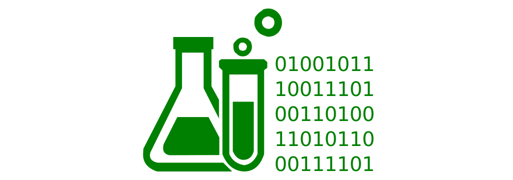

[](https://opensource.org/licenses/Apache-2.0)
[](https://travis-ci.org/jveverka/data-lab.svg?branch=master)

# Data Lab Project
__Data Lab Project__ provides advanced analytics and query services on various document sources like 
images, video streams, text documents, file system. This project is work in progress.


## Features
* __File system indexing__ - queries on file system meta-data
* __Image meta-data indexing__ - queries on exif and geo-location meta data.
* __Video meta-data indexing__ - queries on exif and geo-location meta data.
* __Image content object recognition__ - queries on objects contained in images. 

### Microservices
* [__file-system-service__](file-system-service) - [__microservice__] simple service for scanning file system.
* [__ml-services__](ml-services) - [__microservices__] simple services utilizing using machine learning.

### Components 
* [__elasticsearch-service__](elasticsearch) - [__library__] service for easy elasticsearch read/write access.
* [__data-scanner-service__](data-scanner-service) - [__library__] service for scanning data directory and annotating data files.

### Architecture


### Technology stack
* Microservices - REST, Message Broker integrations, K8s, WIP
* ElasticSearch - main meta-data database
* Kibana - basic data visualizations
* Java 11 - microservice implementations 
* Gradle 6.x - build system 
* TensorFlow 2.0 / Keras - ML related tasks
* Python 3.6.x - microservice implementations

### Run and build
```
gradle clean build test
```
