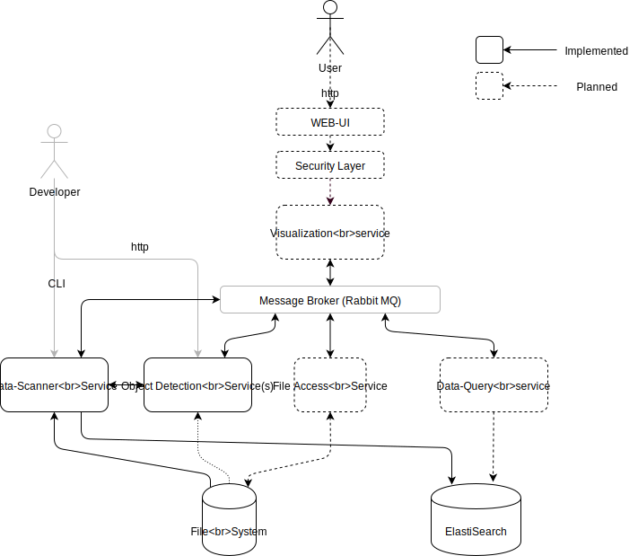

[](https://opensource.org/licenses/Apache-2.0)
[](https://travis-ci.com/jveverka/data-lab.svg?token=GKfpyChfSfp1rNfoYwMM&branch=master)

# Data Lab
Big Data Lab

### Components
* __file-system-service__ - simple service for scanning file system
* __elasticsearch-service__ - service for easy elasticsearch read/write access
* __data-scanner-service__ - service for scanning data directory and annotating data files

### Architecture


### Run and build
```
gradle clean build test
```

