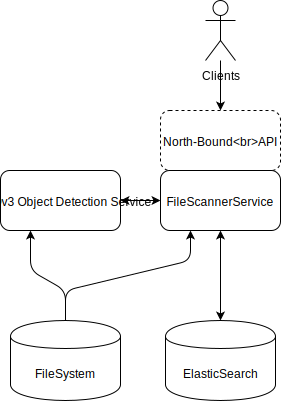
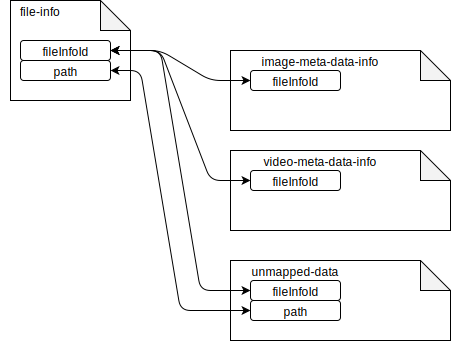

# Data Scanner Service
This micro service is responsible for scanning file system and writing meta-data about scanned files into 
ElasticSearch database.
* Internal APIs: ``itx.dataserver.services.filescanner.FileScannerService``
* External APis: work in progress.

## Architecture


### Implemented features
* __Init DB__ - initialize ElasticSearch indexes. This will delete all data in indices file-info, image-meta-data-info, unmapped-data. 
* __scan filesystem directory__ - recursively scans filesystem directory, produces data is written into ElasticSearch. 
  In case only subdirectory is scanned or re-scanned, existing data in ElasticSearch is database is merged with actual file system state. 
* __record unmapped data__ - special index unmapped-data is reserved for recording failed mappings and file system scan errors. 
  unmapped-data documents may be used for later offline analysis of data transformation errors. 

### ElasticSearch data structure
Relations between indices are on application level. 
Indices have fields in documents which are unique and may be used for query documents related to main __file-info__ index. 



ElasticSearch indices:
* __file-info__ - main index containing file info data obtained from filesystem. 
  This is primary data index, other indices contain complementary information to file-info. 
* __image-meta-data-info__ - index with image-meta-data-info for files, mostly bitmap images like JPEG photos.
* __video-meta-data-info__ - index with video-meta-data-info for files, mostly video streams.
* __annotation-meta-data__ - annotation meta data from file system.
* __unmapped-data__ - unmapped objects serialized in JSON or other file scanning errors.
  In case file scanning or other data mapping fails for particular file, data about this 
  incident is recorded for later analysis as document in unmapped-data index.  

Examples of [ElasticSearch queries](docs/elasticsearch-queries.md) covering various use-cases.

### Directory scanning
File system is scanned recursively starting from root directory. Meta-data are obtained from file system and 
from file content, depending on file type.
* __Images__ - image files are tested for meta-data presence, in case meta-data is present, the record is stored in ElasticSearch. 
* __Videos__ - video files are tested for meta-data presence, in case meta-data is present, the record is stored in ElasticSearch.
* __Annotations__ - in case JSON meta-data file is present in any directory or subdirectory, records within the file are stored in ElasticSearch.
  Default JSON meta-data name is __.annotation-meta-data-bulk.json__.

### Run and Build
```
gradle clean installDist distZip test
```
```
./build/install/data-scanner-service/bin/data-scanner-service -e <n> -p <path> -i -eh <elasstiHost> -ep <elasticPort>
# n - optional, thread pool size, default=1
# path - mandatory, /path/to/root/dir
# elasticHost - optional, hostname of elasticsearch server, default="127.0.0.1"
# elasticPort - optional, port of lasticsearch server, default=9200
# init - optional, if present init elasticsearch indices. all data in indec are lost if init is used. 

# Full directory scan (first time)
./build/install/data-scanner-service/bin/data-scanner-service -p /path/to/dir -i true

# Directory re-scan 
./build/install/data-scanner-service/bin/data-scanner-service -p /path/to/dir/subdir 
```

### Performance tests
| Data Scan Service          | ElasticSearch             | Full Scan [files / duration] |
|----------------------------|---------------------------|------------------------------|
| CPU i7-3632QM, 32GB RAM    | <-                        | 82431 / 1873.0686 s          |
| CPU i7-3632QM, 32GB RAM    | AMD Ryzen 5 3600, 8GB RAM | 82431 / 1705.6926 s          |
| AMD Ryzen 7 3700X, 8GB RAM | CPU i7-3632QM, 32GB RAM   | 82431 / 251.75032 s          |
| AMD Ryzen 7 3700X, 8GB RAM | AMD Ryzen 5 3600, 8GB RAM | 82431 / 158.01813 s          |
