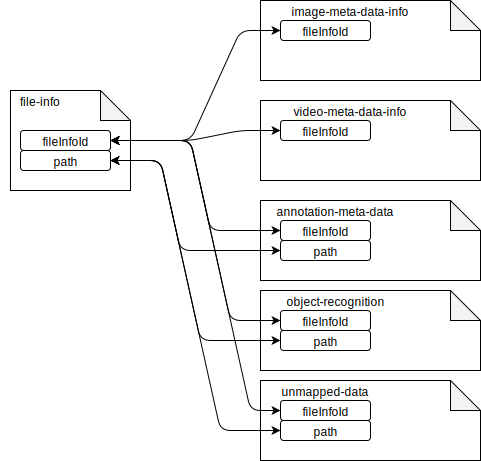

# Data Scanner Service
This service is responsible for scanning file system and writing meta-data about scanned files into 
ElasticSearch database.

## Architecture


### Run and Build
```
gradle clean installDist distZip test
```
```
./build/install/data-scanner-service/bin/data-scanner-service -e <n> -p <path> -i <init> -eh <elasstiHost> -ep <elasticPort>
# n - optional, thread pool size, default=1
# path - mandatory, /path/to/root/dir
# elasticHost - optional, hostname of elasticsearch server, default="127.0.0.1"
# elasticPort - optional, port of lasticsearch server, default=9200
# init - optional, true|false init elasticsearch indices. all data in indec are lost if init = true. 

# Full directory scan (first time)
./build/install/data-scanner-service/bin/data-scanner-service -p /path/to/dir -i true

# Directory re-scan 
./build/install/data-scanner-service/bin/data-scanner-service -p /path/to/dir/subdir 
```

## ElasticSearch data structure
Relations between indices are on application level. 
Indices have fields in documents which are unique and may be used for query documents related to main __file-info__ index. 



Indices:
* __file-info__ - main index containing file info data. 
  This is primary data index, other indices contain complementary information to file-info. 
* __meta-data-info__ - index with meta-data-info for files, mostly bitmap images.
* __unmapped-data__ - unmapped objects serialized in JSON or other file scanning errors.
  In case file scanning or other data mapping fails for particular file, data about this 
  incident is recorded for later analysis as document in __unmapped-data__ index.  
* __*__ - all documents use fileInfoId to match query for single file

[ElasticSearch queries](docs/elasticsearch-queries.md)
