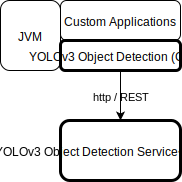

# Java API for YOLOv3 Object Detection Service
This is implementation of java REST client for [YOLOv3 Object Detection Service](../od-yolov3-tf2).
No external dependencies, just Java11 http client.

## Architecture


## Build and Test
JUnit tests
```
gradle clean build test
```
Integration tests, __YOLOv3 Object Detection Service__ must be available at http://127.0.0.1:5000/ 
```
gradle clean build -Dtest.profile=integration --stacktrace --info
```

## Use in your project
Maven dependency:
```
<dependency>
  <groupId>itx.ml.service</groupId>
  <artifactId>od-yolov3-tf2-java</artifactId>
  <version>1.0.0</version>
</dependency>
```
Gradle dependency:
```
implementation 'itx.ml.service:od-yolov3-tf2-java:1.0.0'
```
Use in java code:
```
ObjectRecognitionService ors = new ObjectRecognitionServiceImpl(
                                    InetSocketAddress.createUnresolved("192.168.0.101", 5000)
                               );
ors.getVersion();
...
```